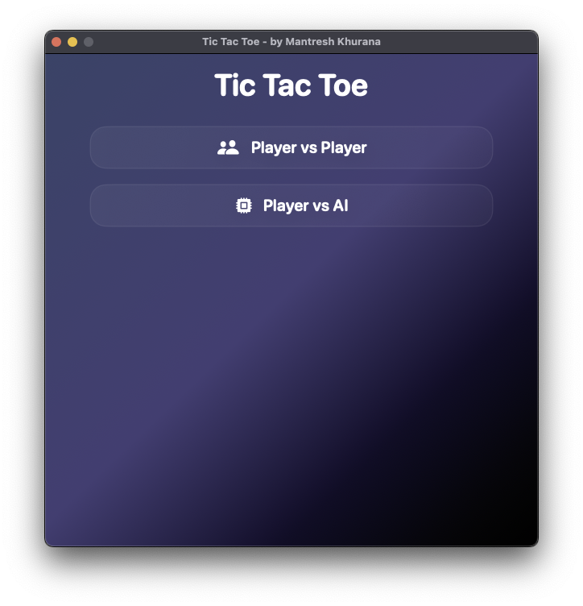
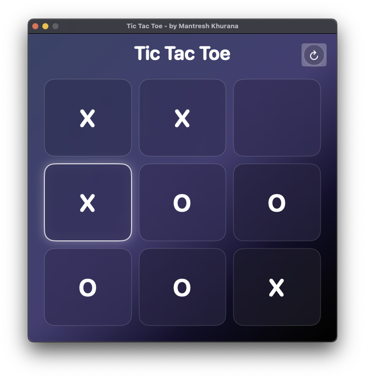

# Tic Tac Toe Game

This is a simple implementation of the Tic Tac Toe game in SwiftUI. The game allows two players to play against each other on a 3x3 grid.

## Screenshots

## Authors
- [Mantresh Khurana](https://github.com/mantreshkhurana)
